# Lumina Notes AI — Architecture

> Companion to the [README](README.md). The README covers *what works today* and *how to run it*;
> this document covers *why the system is shaped the way it is* and *how data moves through it*.

---

## 1. The idea

Studying produces a pile of artefacts that normally live in unrelated tools: the lecture you
attended, the PDF you were assigned, the notes you typed, the cards you drill the night before an
exam. Each one is a different app, and none of them know about each other — so the work of turning
a lecture into revision material is manual, repetitive, and usually skipped.

Lumina's premise is that these artefacts belong in **one connected store**, so each can feed the
next:

```text
lecture audio ──▶ transcript ──▶ structured notes ──▶ flashcards / quizzes ──▶ review history
                                        ▲                                            │
             course PDFs ───────────────┘                                            │
                                        └──────────── what to study next ◀───────────┘
```

Three consequences fall out of that premise, and they explain most of the design:

1. **Capture must be nearly free.** If recording a lecture costs more than opening a notebook,
   nobody does it. Hence the transcription pill — one control, always reachable, never a mode you
   have to navigate into.
2. **Notes are a substrate, not a destination.** A note is the input to flashcards, quizzes,
   semantic search, and AI chat. That is why note content is stored as editor HTML *and* projected
   into a vector embedding and a full-text index.
3. **The review loop closes.** Spaced-repetition scheduling and quiz results are recorded so the
   system can say what is weak and what is due, rather than leaving the student to guess.

---

## 2. Architecture at a glance

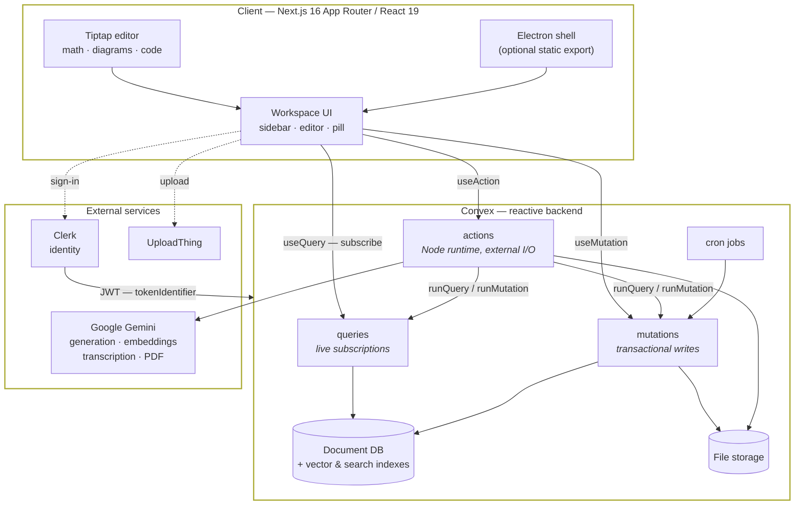

### The one constraint that shapes everything

Convex splits server code into three kinds of function, and the split is not cosmetic:

| Kind | Runtime | Can read/write DB | Can call the network | Used for |
| --- | --- | --- | --- | --- |
| `query` | deterministic | read only | ✗ | Everything the UI subscribes to |
| `mutation` | deterministic, transactional | ✓ | ✗ | All writes |
| `action` | Node (`"use node"`) | ✗ *(only via `runQuery`/`runMutation`)* | ✓ | Gemini calls, URL fetches, file parsing |

Because an **action cannot touch the database directly**, every AI workflow is necessarily a
*choreography*: the action reads what it needs through a query, calls the model, then writes results
back through a mutation. That round-trip is visible in every sequence diagram below, and it is why
long-running work reports progress by patching a status field rather than by holding a connection
open.

The second structural consequence: **queries are live subscriptions, not fetches.** There is no
bespoke REST/GraphQL layer and no client cache to invalidate. A mutation writes; every subscribed
component re-renders. This is why progress indicators (`processingStatus`, `progressPercent`,
`queuePosition`) are stored as ordinary fields — writing them *is* the push notification.

---

## 3. Backend module map

All Convex functions live in `convex/`. Modules split along domain lines; `convex/shared/` holds
pure, framework-free logic that both the backend and the client import so there is exactly one
definition of each rule.

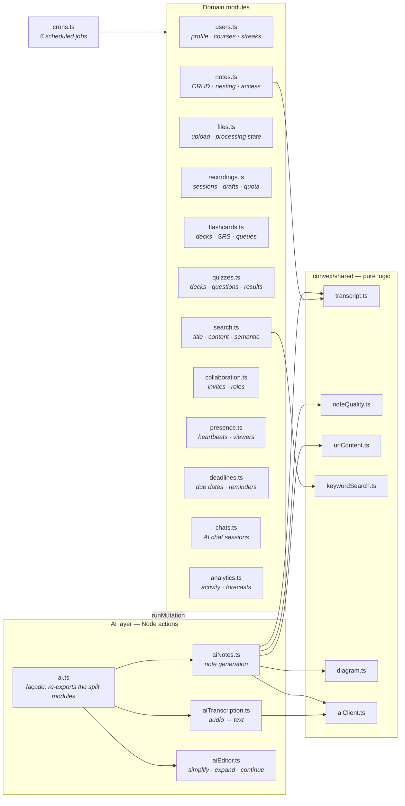

`ai.ts` is a façade — it re-exports `aiNotes`, `aiTranscription`, and `aiEditor` under stable
`api.ai.*` names so client call sites did not have to change when the file was split up.

### Scheduled jobs (`convex/crons.ts`)

| Job | Interval | Purpose |
| --- | --- | --- |
| `srs_backfill` | 6h | Initialise SRS fields on cards created before the scheduler existed |
| `srs_build_daily_queues` | 6h | Precompute each user's due-card queue for the day |
| `file_queue_positions` | 4h | Recompute displayed queue position for pending files |
| `streak_reset` | 24h | Zero out streaks that missed their window |
| `deadline_reminders` | 10m | Fan out reminders into the notifications table |
| `cleanup_stale_notes_and_files` | 24h | Prune untouched records older than 30 days |

---

## 4. Data model

Every user-owned row carries `userId`, which stores the Clerk **`tokenIdentifier`** rather than a
Convex document id. That choice keeps ownership checks to a single string comparison and avoids a
join on the hot path of every query.

### Core: identity, notes, sources

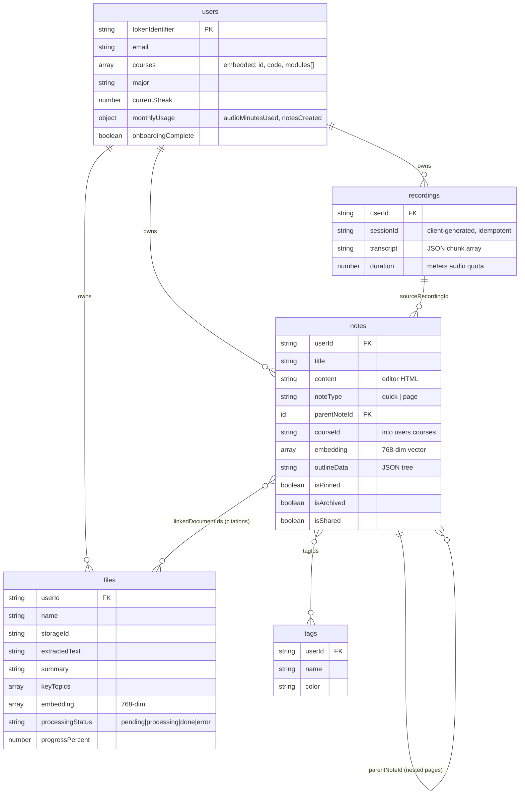

**Courses are embedded, not a table.** A user's courses and modules live as a nested array on the
`users` document, and notes reference them by plain string id. This trades referential integrity for
a single read — the sidebar renders the whole course tree from one document — and is why deleting a
course is a `users` patch rather than a cascade.

### Study: spaced repetition and quizzes

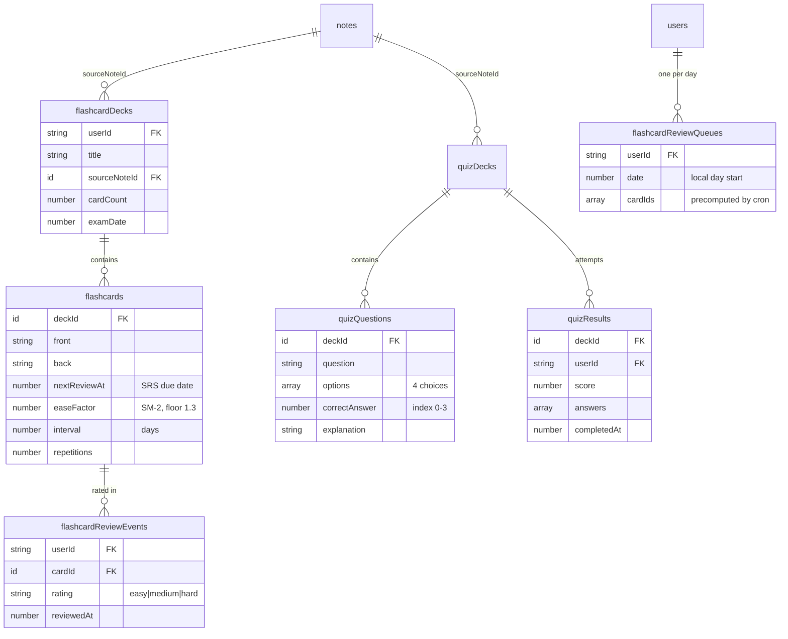

`flashcardReviewEvents` is deliberately append-only and separate from the card row. The card holds
*current* scheduling state; the event log holds *history*, which is what `analytics.ts` reads to
compute weak topics and readiness forecasts without mutating scheduling data.

### Collaboration, planning, and chat

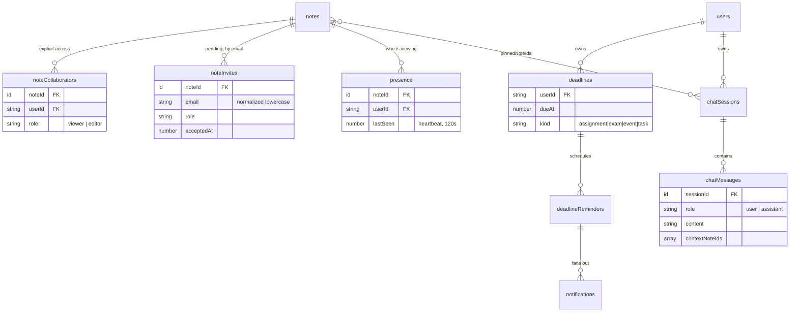

Invites are keyed by **email** because the invitee may not have an account yet.
`collaboration.acceptPendingInvites` fires from `app/dashboard/layout.tsx` once a session is
authenticated, converting any matching `noteInvites` row into a `noteCollaborators` row now that a
`tokenIdentifier` exists.

### Index strategy

Three index families do distinct jobs, and picking the wrong one is the usual cause of a slow list:

| Family | Example | Answers |
| --- | --- | --- |
| **Compound B-tree** | `notes.by_userId_and_pinned` | "this user's pinned notes", ordered, cheap |
| **Full-text search** | `notes.search_title`, `notes.search_content` | "which notes mention *recursion*" |
| **Vector** | `notes.by_embedding` (768-dim, filtered by `userId`) | "which notes are *about* this idea" |

`search_content` is the newest addition — before it, note search matched titles only, so a note whose
body discussed a topic was unfindable unless the title named it.

---

## 5. Workflows

### 5.1 Lecture capture → structured notes

The transcription pill (`components/dashboard/transcribe/`) owns this loop. Speech recognition runs
**in the browser** via the Web Speech API; a parallel `getUserMedia` stream feeds an `AnalyserNode`
purely to drive the waveform, because the Speech API exposes no audio data of its own.

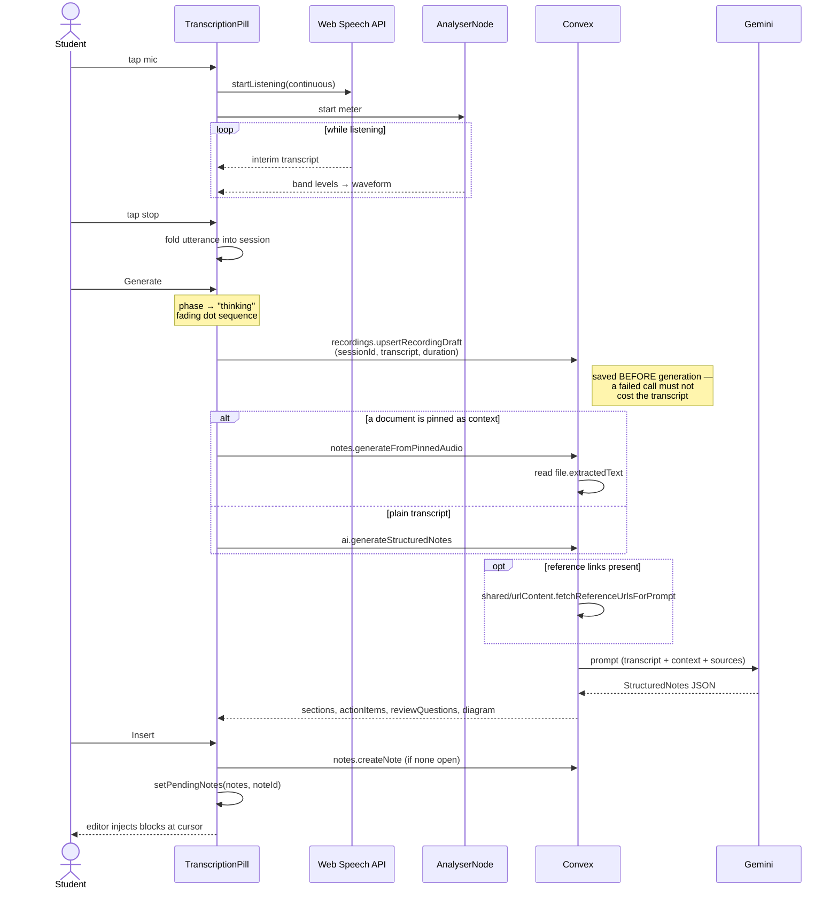

The `pendingNotes` handoff is worth noting: the pill does not write note *content* itself. It parks
the generated structure in React context scoped to a target note id, and `NoteView` picks it up and
converts it into Tiptap nodes. That keeps document mutation in one place — the editor — rather than
having two components racing to write the same field.

### 5.2 Document ingestion (PDF → searchable source)

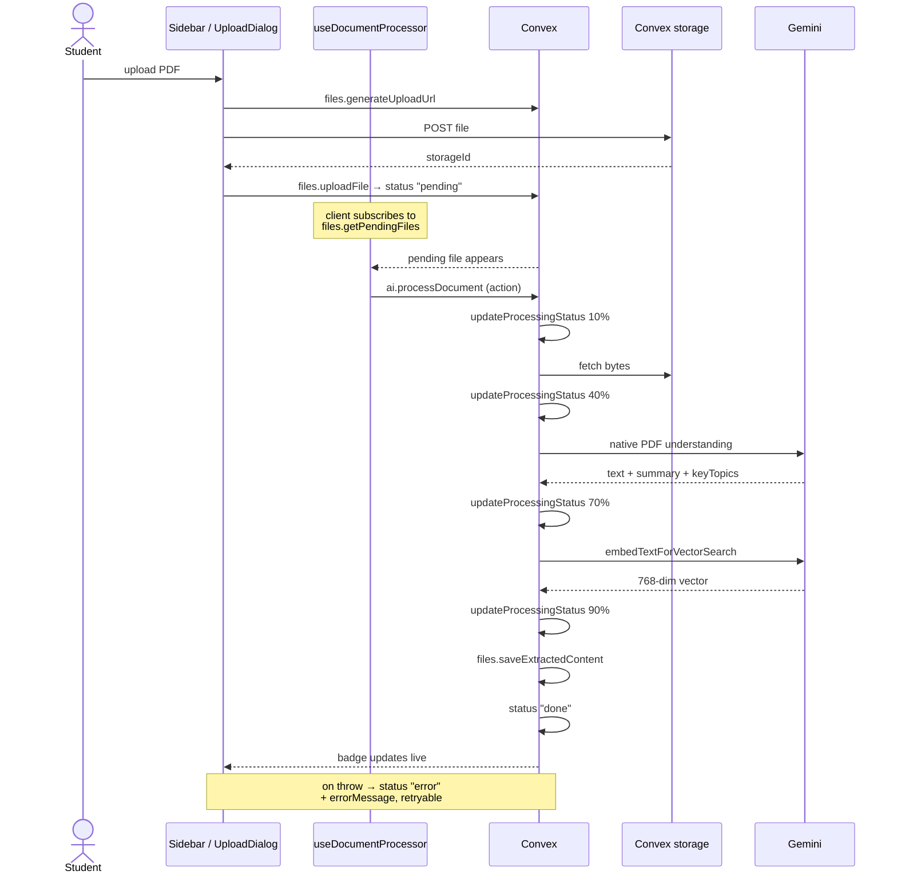

**The processing queue is client-driven.** `useDocumentProcessor` subscribes to pending files and
invokes the action. That is a deliberate simplification with a real trade-off: work only advances
while a tab is open, and two open tabs can both pick up the same file. The `queuePosition` cron and
the status field make the situation legible to the user rather than fixing it — a server-side
scheduler would be the correct next step if ingestion volume grows.

### 5.3 Flashcards and the spaced-repetition loop

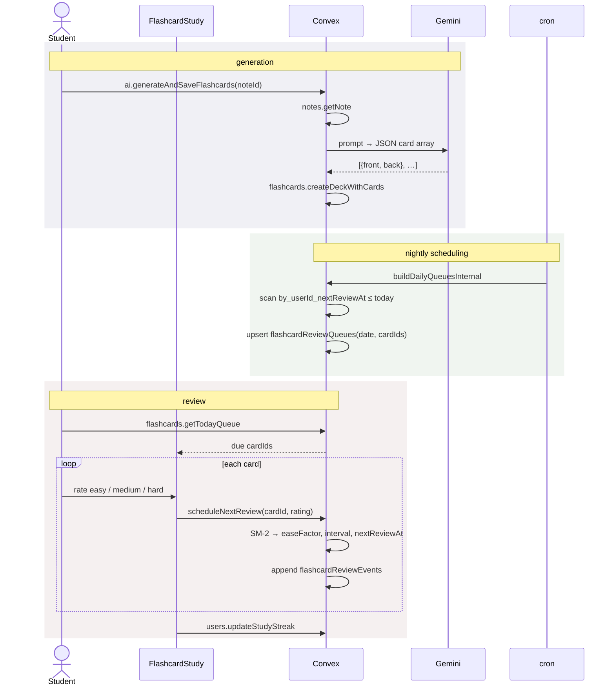

Scheduling is a SM-2 variant in `lib/spacedRepetition.ts` (`DEFAULT_EASE_FACTOR = 2.5`, floored at
`MIN_EASE_FACTOR = 1.3`). It lives in `lib/` as pure functions so the same maths is unit-tested
directly and reused by the analytics forecast.

### 5.4 Search — three tiers

Search is not one mechanism but three, chosen by what the user is trying to do:

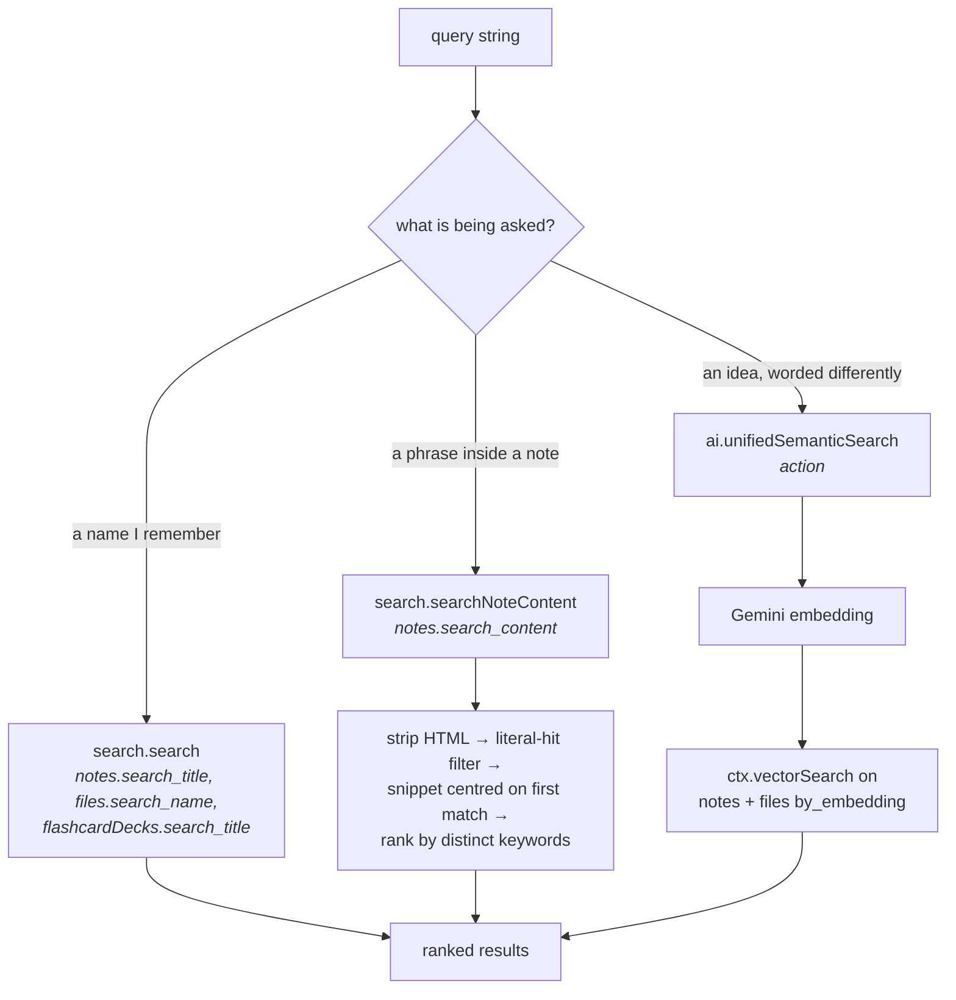

The content tier deserves a note. The full-text index matches *stemmed tokens*, so it can return a
note that contains no literal occurrence of the query. `searchNoteContent` therefore re-checks each
candidate for a literal hit before building a snippet — otherwise it would return rows with nothing
to highlight. Snippet building and highlight segmentation are shared pure functions
(`convex/shared/keywordSearch.ts`), so the server and the pill's result list agree on what "matched".

### 5.5 Access control

Every note-touching function funnels through one of three guards in `convex/notes.ts`:

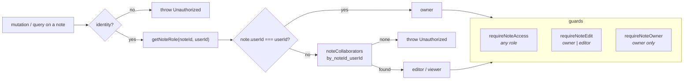

Public share links (`notes.toggleShareNote` → `notes.getPublicNote`) are the one path that bypasses
this, gated on the note's own `isShared` flag rather than on identity.

---

## 6. Client architecture

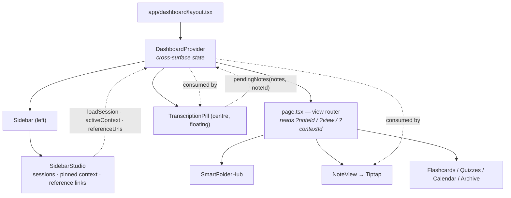

Two patterns carry most of the weight:

- **The URL is the view state.** `app/dashboard/page.tsx` is a switch over search params
  (`?noteId`, `?view=flashcards`, `?contextId`), and every heavy view is a `lazy()` import. Navigation
  is `router.push` with a query string, so views are linkable and back/forward work for free.
- **`DashboardProvider` is a handoff bus, not a store.** It holds only state that must cross
  surfaces that never render each other: the sidebar handing a saved session to the pill, the pill
  handing generated notes to the editor, a pinned file travelling from the file list into
  generation. Everything else is a Convex subscription, because Convex is already the cache.

### Where the editor's capabilities come from

`NoteView` composes Tiptap with custom node views in
`components/dashboard/editor/extensions/` — math (KaTeX), Mermaid diagrams, charts, a graphing
calculator, images, and collapsible outline items — plus a slash-command palette and an AI bubble
menu. Note styles (`standard`, `outline`, …) switch which editor surface renders, not just the CSS.

---

## 7. Notable decisions and their trade-offs

| Decision | Why | What it costs |
| --- | --- | --- |
| Convex instead of a REST/GraphQL API | Live queries remove cache invalidation entirely; the DB *is* the push channel | AI work must choreograph action → mutation; no direct DB access in actions |
| `userId` stores Clerk `tokenIdentifier` | Ownership is one string compare, no join | Rows are tied to the identity provider's id format |
| Courses embedded on `users` | Whole course tree in one read | No referential integrity; deletes are patches |
| Client-driven document processing | No queue infrastructure to run | Stalls when no tab is open; duplicate pickup possible |
| Editor HTML as the note's source of truth | One format for display, export, and print | Search and AI need an HTML→text projection first |
| Pure logic in `convex/shared/` | Server and client enforce identical rules | Client bundles a little backend code |
| Browser speech recognition | Zero latency, no audio upload for live capture | Browser-dependent; imported audio still needs Gemini |

---

## 8. Where to start reading

| To understand… | Read |
| --- | --- |
| The data model | `convex/schema.ts` |
| Any AI workflow | `convex/aiNotes.ts`, then `convex/shared/aiClient.ts` |
| Capture end to end | `components/dashboard/transcribe/TranscriptionPill.tsx` |
| How views are routed | `app/dashboard/page.tsx` |
| Access rules | the guards at the top of `convex/notes.ts` |
| Scheduling maths | `lib/spacedRepetition.ts` + `tests/logic/spacedRepetition.test.ts` |
